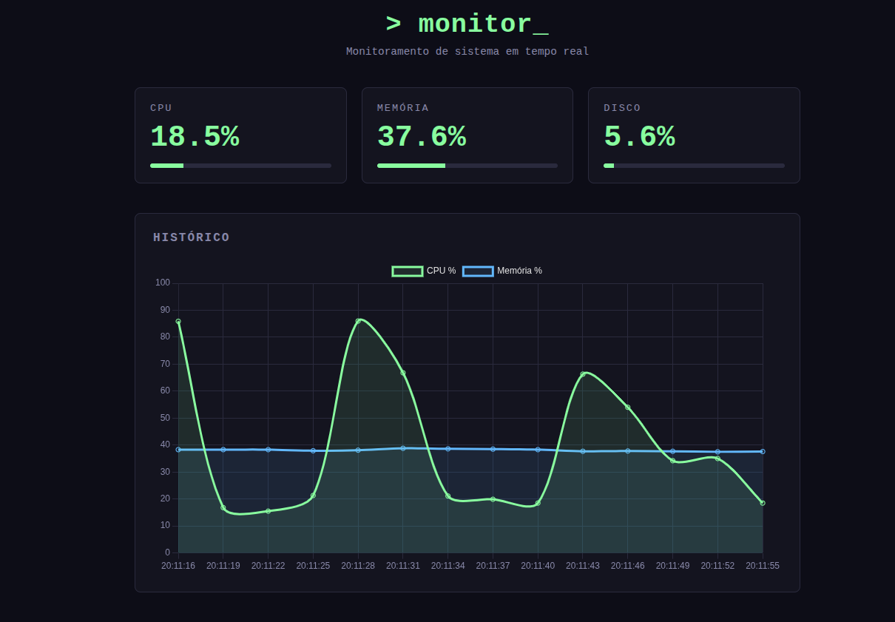

# Dashboard de Monitoramento

Dashboard web para acompanhar métricas de sistema (CPU, memória e disco) em tempo real, com gráfico de histórico.



## Tecnologias

- **Python** — linguagem principal
- **psutil** — coleta de métricas do sistema
- **FastAPI** — API que expõe as métricas via HTTP
- **Uvicorn** — servidor ASGI que roda a API
- **HTML/CSS/JavaScript** — frontend
- **Chart.js** — gráfico de histórico em tempo real

## Como rodar localmente

### Pré-requisitos
- Python 3.10+ instalado

### Passo a passo

1. Clone o repositório
```bash
git clone https://github.com/RudolfoSehnemCode/dashboard-monitoramento.git
cd dashboard-monitoramento
```

2. Crie e ative o ambiente virtual
```bash
python3 -m venv venv
source venv/bin/activate
```

3. Instale as dependências
```bash
pip install fastapi uvicorn psutil
```

4. Rode a API
```bash
uvicorn backend.main:app --reload
```

5. Abra o `frontend/index.html` no navegador 

A API precisa continuar rodando no terminal enquanto o dashboard estiver aberto.

## Próximos passos

- Persistência de histórico com banco de dados
- Autenticação na API
- Deploy para acesso remoto sem precisar rodar localmente

## Autor

Rudolfo Sehnem